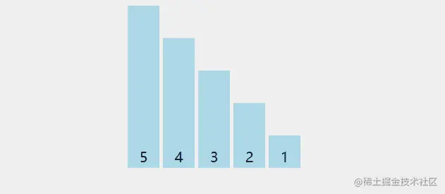
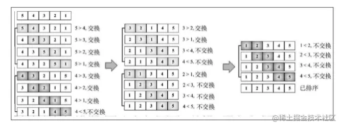
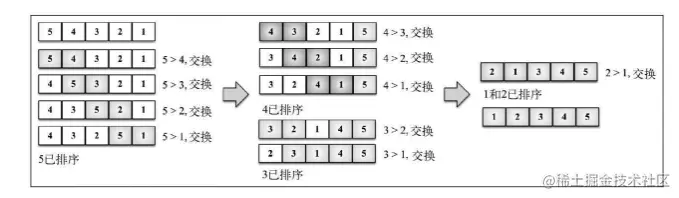

「这是我参与2022首次更文挑战的第14天，活动详情查看：[2022首次更文挑战](https://juejin.cn/post/7052884569032392740 "https://juejin.cn/post/7052884569032392740")」

介绍
--

如果要学习排序算法，大多会先从冒泡算法开始，因为它是所有排序算法中最简单的一个。不过它也是最慢的一个。

冒泡排序比较所有相邻的两个项，如果第一个比第二个大，则交换它们。元素项向上移动至正确的顺序，就好像气泡升至表面一样，冒泡排序因此得名。



实现
--

冒泡算法依次比较相邻两项，判断大小，并做交换。每一轮都只能确定一个数字的位置，因此如果有n个数，需要比较n轮。算法实现如下：

```ini
function bubbleSort(array) {
  const { length } = array;
  for (let i = 0; i < length; i++) {
    for (let j = 0; j < length - 1; j++) {
      if (array[j] > array[j + 1]) {
        [array[j], array[j + 1]] = [array[j + 1], array[j]]
      }
    }
  }
  return array
}
bubbleSort([5, 4, 3, 2, 1]) //  [1, 2, 3, 4, 5]

```

_这里用了es6的语法 `[array[j], array[j + 1]] = [array[j + 1], array[j]]`，一行代码便可以交换两个数 的位置_。

下图展示了冒泡排序的执行过程： 

优化
--

冒泡算法有两层循环，外循环一共执行了5次，每轮内循环执行4次。但是外循环第一轮就可以求出最大的值5，第二轮的内循环只需执行3次，不需要比较4和5。因此如果从内循环减去外循环中已跑过的轮数，就可以避免内循环中所有不必要的比较。

```ini
function bubbleSort(array) {
  const { length } = array;
  for (let i = 0; i < length; i++) {
    for (let j = 0; j < length - 1 - i; j++) {
      if (array[j] > array[j + 1]) {
        [array[j], array[j + 1]] = [array[j + 1], array[j]]
      }
    }
  }
  return array
}
```

改进后的执行过程如下：



即便我们对它做了优化，冒泡算法的复杂度仍然是O(n2)O(n^2)O(n2)，因此在排序实践中，冒泡用的并不多。