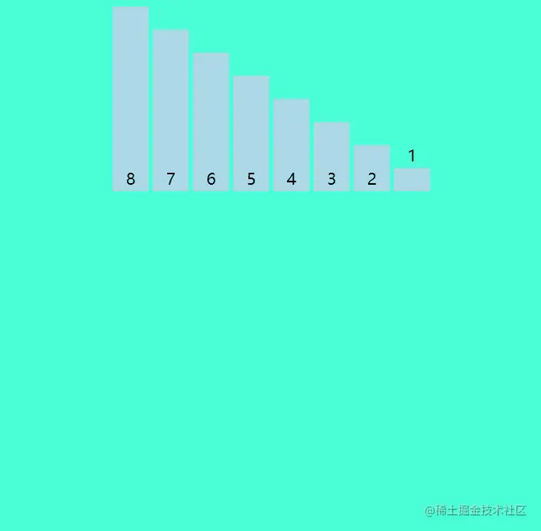
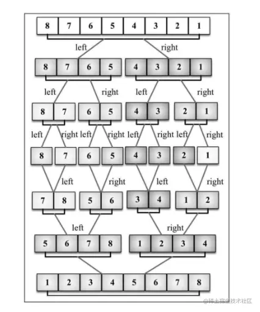
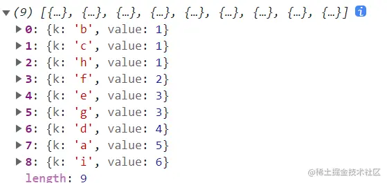

「这是我参与2022首次更文挑战的第17天，活动详情查看：[2022首次更文挑战](https://juejin.cn/post/7052884569032392740 "https://juejin.cn/post/7052884569032392740")」

介绍
--

归并排序是第一个可以实际使用的排序算法，它的复杂度是O(nlog(n))O(nlog(n))O(nlog(n))。前面三种排序算法的复杂度都是O(n2)O(n^2)O(n2)，在最坏的情况下，每个数都要和其他任意一个数比较，但归并算法不需要。

归并排序是一种分而治之算法。其思想是将原始数组切分成较小的数组，直到每个小数组只有一个位置，接着将小数组归并成较大的数组，直到最后只有一个排序完毕的大数组。

这里举一个最简单的例子来解释为什么归并算法的性能比前面三种更好：

比如排序3,1,4,2，则可以分为两组：3和1排序得1,3；4和2排序得2,4，之后再将这两组合并，1和2比，可以确定1的位置，而不用再与4比较，从而节省1次比较。

可以从下面的两个图理解归并算法分组——排序——合并的过程：





实现
--

根据归并算法的思想，我们需要将排序函数分为两个部分：分组和排序合并。

```css
function mergeSort(array, compare) {
  if (array.length > 1) {
    const { length } = array;
    const middle = Math.floor(length / 2);
    // 递归分组
    const left = mergeSort(array.slice(0, middle), compare);
    const right = mergeSort(array.slice(middle), compare);
    // 比较并合并
    array = merge(left, right, compare)
  }
  return array;
}
function merge(left, right, compare = (a, b) => a > b) {
  let i = 0; let j = 0;
  const result = [];
  while (i < left.length && j < right.length) {
    // 这里的判断注意稳定性
    compare(left[i], right[j]) > 0 ? result.push(right[j++]) : result.push(left[i++]);
  }
  const x = result.concat(i < left.length ? left.slice(i) : right.slice(j))
  return x;
}
```

这个算法实现的时候需要注意稳定性，如果两个值一样，则应该保持原先的顺序。

测试稳定性
-----

为了测试我们实现的函数的排序稳定性，额外增加了一个comapre函数，该函数和`Array.prototype.sort`的第二个参数一样，当返回值大于0时，调换两个值的顺序。

测试代码及输出如下：

```css
var arr = [5, 1, 1, 4, 3, 2, 3, 1, 6].map((item, index) => ({ k: String.fromCharCode(97 + index), value: item }))
mergeSort(arr, (a, b) => {
  return a.value - b.value
})
```

