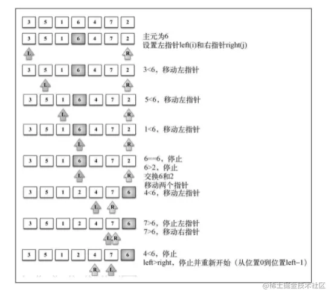
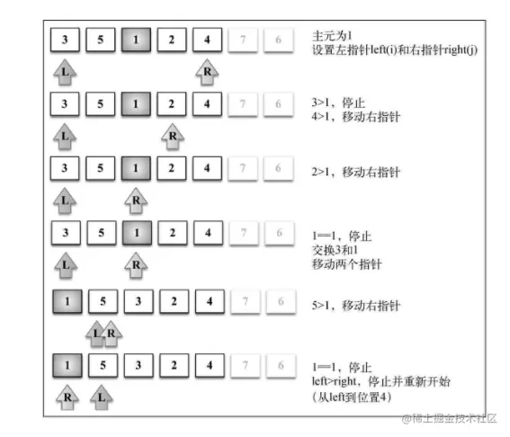
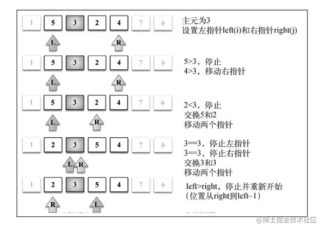
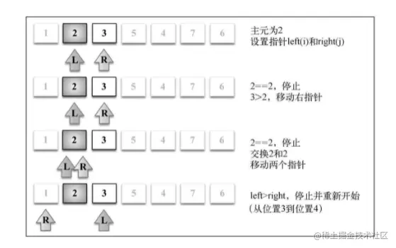
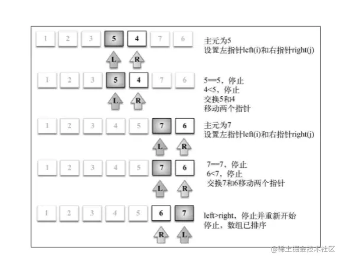

「这是我参与2022首次更文挑战的第18天，活动详情查看：[2022首次更文挑战](https://juejin.cn/post/7052884569032392740 "https://juejin.cn/post/7052884569032392740")」

介绍
--

快排算法是最常用的算法之一，它的复杂度是O(nlog(n))O(nlog(n))O(nlog(n))。

快排算法步骤比较复杂，这里总结一下它大致的思路：

1.  从数组中去一个值作为主元pivot
2.  创建两个指针，分别从左和右开始，将指针指向的值与主元pivot比较
3.  如果左指针指向的值>pivot,则将这个值与右指针指向的值交换；同理如果右指针指向的数比pivot更大，则将其与左指针指向的数交换
4.  直到两个指针交叉 上面的过程称之为划分partition，这一步结束后可以得到两个数组：较小值数组和较大值数组。

比如3,5,2,4,1，我们去中间值2作为pivot，第一次划分得到的结果是：1,5,2,4,3，过程中进行了2次交换，意味着左边2个数是比pivot更小的，因此这里将数组划分为1,2和5,4,3两个部分。

然后再分别对左右两个数组进行划分，最终得到排序后的结果。

实现
--

```sql
function quickSort(array) {
  return quick(array, 0, array.length - 1)
}
function quick(array, left, right) {
  let index;
  if (array.length > 1) {
    index = partition(array, left, right)
    if (left < (index - 1)) {
      quick(array, left, index - 1)
    }
    if (index < right) {
      quick(array, index, right)
    }
  }
  return array;
}
function partition(array, left, right) {
  const pivot = array[Math.floor((left + right) / 2)];
  let i = left; let j = right;
  while (i < j) {
    while (array[i] < pivot) {
      i++
    }
    while (array[j] > pivot) {
      j--
    }
    if (i <= j) {
      [array[i], array[j]] = [array[j], array[i]];
      i++;
      j--;
    }
  }
  return i
}

```

需要注意的是，快速排序算法并**不是稳定排序**。

假设数组是`[3, 5, 1, 6, 4, 7, 2]`,下面一步步展示算法过程:

1.  对数组进行第一次划分：



2.  对较小值数组`[3,5,1,2,4]`进行划分：



3.  继续对子数组`[5,3,2,4]`进行划分



4.  分别比较`[2,3]`和`[5,4]`,最后比较较大值数组`[7,6]`



