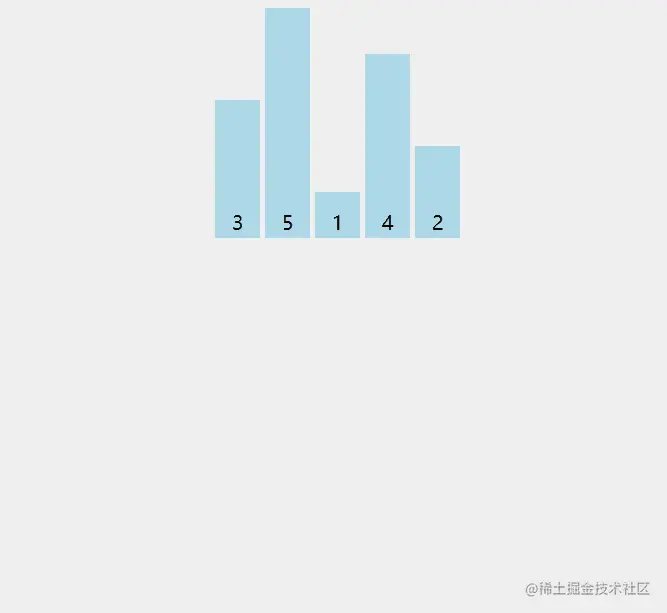

「这是我参与2022首次更文挑战的第16天，活动详情查看：[2022首次更文挑战](https://juejin.cn/post/7052884569032392740 "https://juejin.cn/post/7052884569032392740")」

介绍
--

插入排序是依次取出一个数，并和前面的数比较大小，插入到合适的位置。

就好像我们手动整理一副乱序的扑克，先将第2张和第1张比，如果比第1张小，则放在它前面；然后将第3张和第2张比，如果比它小，再和第1张比，如果比它大，则插入到第2和第1张中间。



实现
--

js代码实现如下：

```php
function insertSort(array) {
  const { length } = array;
  // 这里从第2个数开始往前比
  for (let i = 1; i < length; i++) {
    let j = i;
    // 后续计算的过程会修改i位置的值，因此需要保存一个临时变量
    const temp = array[i]
    while (j > 0 && array[j - 1] > temp) {
      // 如果前一个数小于待插入的数，则将前一个数后移一位
      array[j] = array[j - 1]
      j--
    }
    // 最后j就是需要插入的位置，这个位置上原本的数已经后移了一位
    array[j] = temp
  }
  return array;
}

```

这个算法实现的时候需要注意减少赋值次数：

比如3,5,1,4,2。当待插入数为1时，1与5比较，1<5,则对5后一个位置赋值5，但不需要此时就将1插入到5原先的位置（不需要交换1和5的位置）。之后1与3比较，1<3，则继续将3后一个位置赋值为3，这样通过向后赋值，完成数组的位移。

插入算法的执行过程可以参考下图：


插入排序的时间复杂度O(n2)O(n^2)O(n2)，与冒泡排序一样，在实践中也只应用于小型数组，但是它的性能要比冒泡排序更好。

为什么说插入排序优于冒泡排序
--------------

插入排序和冒泡排序都是稳定排序，而插入排序比冒泡更优的点在于赋值次数。

同样对3,5,1,4,2进行排序：

冒泡排序比较5和1时会直接交换：3,1,5,4,2，通常需要3次赋值。

```ini
// 交换x和y
temp = x;
x=y;
y=temp;

```

而插入排序比较5和1时，仅做一次赋值：3,5,5,4,2。