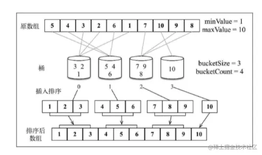

「这是我参与2022首次更文挑战的第28天，活动详情查看：[2022首次更文挑战](https://juejin.cn/post/7052884569032392740 "https://juejin.cn/post/7052884569032392740")」

介绍
--

桶排序，又称为箱排序，也是一种分布式排序算法。大致思想是先对元素进行分组（桶），然后对每个组内的元素进行排序（借助其他排序算法），最后将所有的桶合并为结果数组。

桶排序在最优情况下的时间复杂度为O(n)O(n)O(n),这种情况下每个桶只有一个数字，不需要进行比较。但是如果数据量巨大，会创建大量的桶而占用更多的内存。

实现
--

首先准备一个简单的排序算法，比如插入排序（归并或快排是更好的选择，插入排序的复杂度更高，不过胜在简单，另外桶排序和核心也并不在这点上）。

```js
function insertSort(array) {
  const { length } = array;
 
  for (let i = 1; i < length; i++) {
    let j = i;
    const temp = array[i]
    while (j > 0 && array[j - 1] > temp) {
      array[j] = array[j - 1]
      j--
    }
    array[j] = temp
  }
  return array;
}

```

桶排序算法如下：

首先需要指定每个桶存最多存放多少数据，这里默认指定为3。桶排序需要尽量将数据平均分配到桶中，如果数据比较密集，使用较少的桶更好。

桶排序的过程需要两个函数来实现：分组和排序。

```php
function bucketSort(array, bucketSize = 3) {

    if (array.length < 2) {

        return array;

    }

    const buckets = createBuckets(array, bucketSize)

    return sortBuckets(buckets)

}
```

### 分组

然后确定创建多少个桶，需要找到最大值和最小值，并以`Math.ceil((max - min + 1) / bucketSize)`得到`bucketCount`。

之后需要将所有元素分配到每个桶中，这里用`Math.floor((array[i] - min)/bucketSize)`确定该数字属于哪个桶。

```ini
// 进行分组
function createBuckets(array, bucketSize) {
    // 找到最大值和最小值
    let min = array[0];

    let max = array[0];

    for (let i = 1; i < array.length; i++) {

        if (array[i] < min) {

            min = array[i]

        } else if (array[i] > max) {

            max = array[i]

        }

    }
    // 根据最大值、最小值和每组个数，确定桶的个数。
    const bucketCount = Math.ceil((max - min + 1) / bucketSize)

    const buckets = [];
    // 创建桶，初始为空
    for (let i = 0; i < bucketCount; i++) {

        buckets[i] = []

    }
    // 将每个元素分配桶各自的桶中
    for (let i = 0; i < array.length; i++) {

        const bucketIndex = Math.floor((array[i] - min)/bucketSize)

        buckets[bucketIndex].push(array[i])

    }

    return buckets

}
```

### 排序

使用其他排序算法，对每个桶内的数字进行排序，最后再合并

```js
function sortBuckets(buckets) {

    const sortedArray = [];

    for (let i = 0; i < buckets.length; i++) {

        if (buckets[i] !== null) {

            insertionSort(buckets[i]);

            sortedArray.push(...buckets[i])

        }

    }

    return sortedArray;

}
```

对以上实现的桶排序，计算过程可以参考下图：

