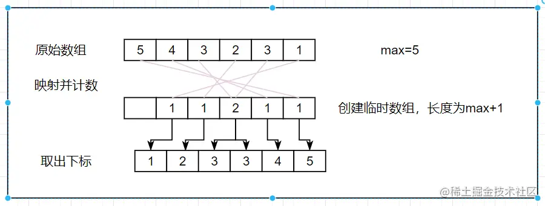

「这是我参与2022首次更文挑战的第21天，活动详情查看：[2022首次更文挑战](https://juejin.cn/post/7052884569032392740 "https://juejin.cn/post/7052884569032392740")」

介绍
--

前面的算法都是通过比较得到值的位置，但是计数排序并不需要进行比较。基于比较的排序算法，理论上的时间复杂度下限为O(nlog(n))O(nlog(n))O(nlog(n))，而计数排序时间复杂度为O(n+k)O(n+k)O(n+k)。

计数排序的原理时借助一些特殊的数据结构来帮助我们进行排序，比如数组。首先遍历输入数组，得到最大值m，然后创建一个临时数组，然后遍历输入数组，将每个值放入临时数组的下标，最后只要遍历临时数组有哪些下标，就可以得到排序后的结果。

从这个原理可以看出，计数排序有一个前提——整数排序，并且由于需要创建额外的临时数组，它所需要的空间要更多。

实现
--

js实现如下：

```js
function findMax(array) {
  let max = array[0];
  array.forEach(item => {
    item > max && (max = item);
  });
  return max;
}
function countingSort(array) {
  if (array.length < 2) return array;
  const max = findMax(array);
  const counts = new Array(max + 1);
  array.forEach(item => {
    if (!counts[item]) {
      counts[item] = 0;
    }
    counts[item]++;
  });
  console.log('counts:', counts);
  let sortedIndex = 0;
  counts.forEach((count, i) => {
    while (count > 0) {
      array[sortedIndex++] = i;
      console.log(count, i, array);
      count--;
    }
  });
  return array;
}

```

对`[5, 4, 3, 2, 3, 1]`排序，执行过程如下：

1.  得到最大值5，创建长度为5+1的临时数组
2.  遍历数组，将每个值放到临时数组相应的坐标上，计数+1。比如遍历到的值为3，则在临时数组下标为3的位置计数count为1，再次遍历到3时，临时数组下标为3的位置计数count增为2
3.  从临时数组中取出count>0下标,下标数组即为排序后的数组



### 冷知识

js中的数组是不定长数组，因此无需关注最大值。如果没有按照index顺序设置值，则跳过的index上的值为empty，且该值和index都不会被forEach遍历到。

```js
var arr = [];
arr[5] = 1;
arr[3] = 2;
// arr: [空属性 × 3, 2, 空白, 1]
arr.forEach((element,index)=>{console.log(element,index)})
// 2 3
// 1 5
```