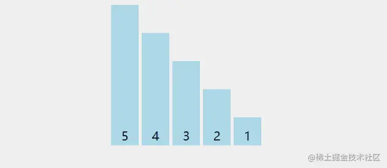
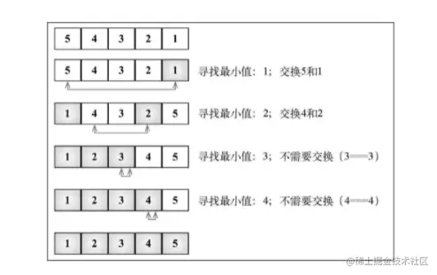

「这是我参与2022首次更文挑战的第15天，活动详情查看：[2022首次更文挑战](https://juejin.cn/post/7052884569032392740 "https://juejin.cn/post/7052884569032392740")」

介绍
--

选择排序算法是一种原址比较排序算法。选择排序大致的思路是找到数据结构中的最小值并将其放置在第一位，接着找到第二小的值并将其放在第二位，以此类推。

排序算法的执行过程可以参考下图（红色标注的变化就是最小值寻找的过程）：



实现
--

我们需要实现的，是一个不断寻找最小值并交换顺序的过程。

首先从第一位开始往后比较，得到第一个最小值，并将它和首位交换；之后从第二位开始，寻找最小值，并将它和第二位数交换，依次往下，直到最后。因此这里也需要两层循环，实现如下：

```ini
function selectionSort(array) {
  const { length } = array;
  let indexMin;
  for (let i = 0; i < length - 1; i++) {
    // 设置当前最小值的下标为i(初始为0)
    indexMin = i;
    for (let j = i+1; j < length; j++) {
      if (array[indexMin] > array[j]) {
        // 比较大小，并更改下标
        indexMin = j;
      }
    }
    // 当内循环完成时得到了最小值的下标
    // 和一开始设置的不一样，则交换两个数的位置，将最小值挪到前面
    if (i !== indexMin) {
      [array[i], array[indexMin]] = [array[indexMin], array[i]]
    }
  }
  return array
}
```

选择排序的执行过程如下图所示： 

数组底部的箭头指示出当前迭代轮寻找最小值的数组范围（内循环），示意图中的每一步则表示外循环。

选择排序与冒泡排序一样，有两层循环，它的复杂度也是O(n2)O(n^2)O(n2)。

选择排序的不稳定性
---------

另外相比冒泡排序，选择排序还有一个缺点：不稳定。

假设ABC三个数分别为： A(5)，B(5)，C(1)，将它们从小到大排序后为：C(1)，B(5)，A(5)，A和B的顺序被破坏了，这就是选择排序的不稳定性。