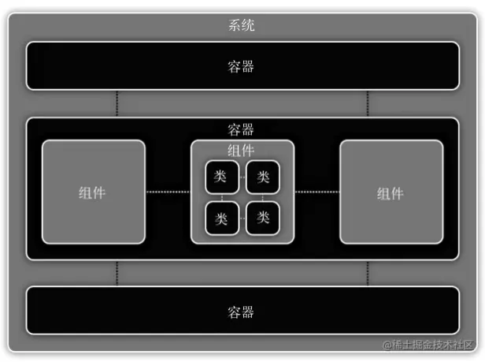
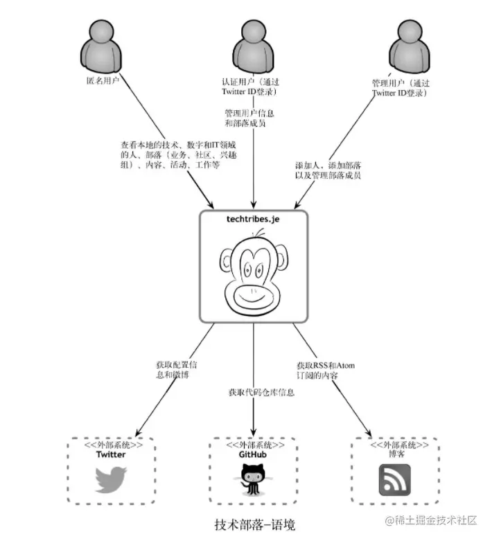
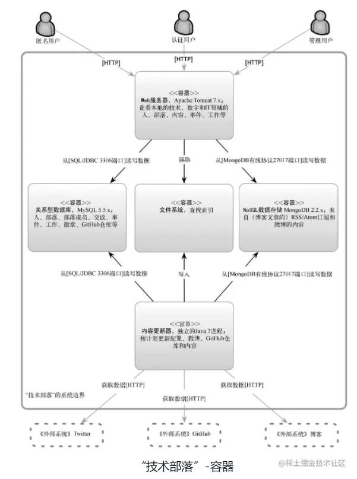
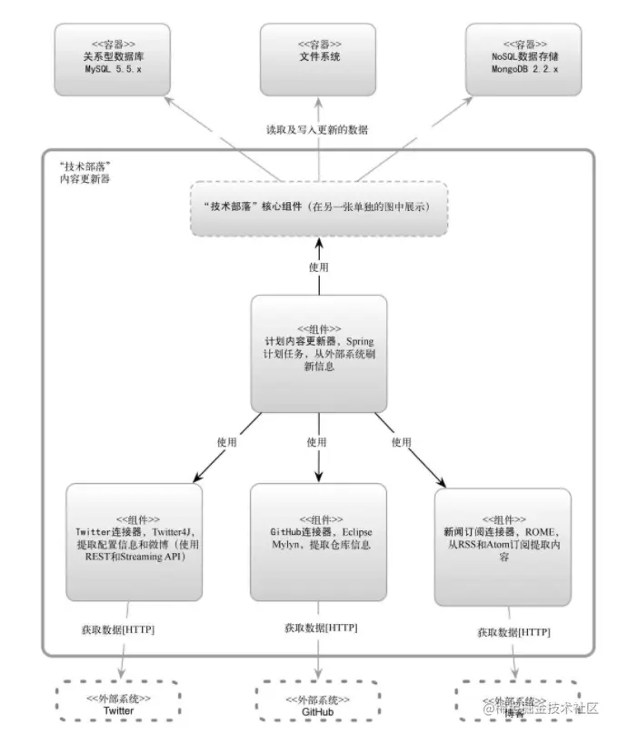
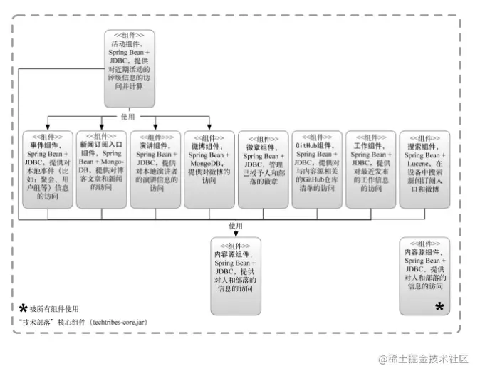
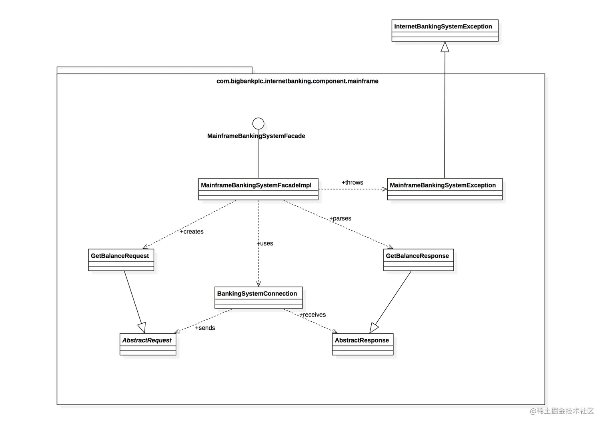

「这是我参与2022首次更文挑战的第13天，活动详情查看：[2022首次更文挑战](https://juejin.cn/post/7052884569032392740 "https://juejin.cn/post/7052884569032392740")」

前言
--

Simon Brown在《程序员必读之软件架构》中介绍了一种建模方法：C4模型。我觉得这是一种简单但很实用的架构方法，无论是在做软件设计还是做产品设计都可以借鉴这个模型思考。

介绍
--

C4模型认为，大多数软件系统都可以划分为4个层次：

*   **系统** 也称系统上下文或语境。这一层标识环境、参与者、外部软件系统和软件系统。
*   **容器** 容器可以是应用程序、数据存储、微服务等，它标识高维度上的技术选择，以及各容器的职责划分、如何通信。
*   **组件** 将单个容器放大，显示其中关键逻辑组件及它们间的关系。
*   **代码** 这一层即最直接的代码，包括接口和类。

系统上下文（语境图）
----------

给软件系统画图和做文档时，语境图是很有用的起点，让你可以后退一步观察大局。

语境图中间以一个简单的框图展示你的系统，周围是它的用户和其他与之相互作用的系统。

语境图需要回答这三个问题：

1.  我们构建的（或已经构建的）软件系统是什么？
2.  谁会用它？
3.  如何融入已有的IT环境？ 我们可以从下面几个维度进行整理和标注：

*   用户与角色：有哪些人会使用这个系统，分别扮演什么角色和使用哪些功能
*   其他系统：比如监控系统，第三方系统等
*   交互：确定该系统与用户和其他系统的交互内容以及通信方式

容器图
---

一旦通过语境图了解了你的系统如何融入整个IT环境，真正有用的下一步就是通过容器图说明高层次的技术选择。

所谓容器，是指组成软件系统的逻辑上的可执行文件或过程。比如web服务器、应用服务器、业务流程编排引擎、数据库、定时任务的工作容器、浏览器等。

每个容器需要指定名称、技术、职责。 

容器图需要回答以下问题：

1.  软件系统的整体形态是什么样的？
2.  高层次技术决策有哪些？
3.  职责在系统中如何分布？
4.  容器之间如何相互交流？
5.  为了实现特性，作为一个开发者，我需要在哪里写代码？ 除了罗列系统中的容器，我们可以从交互与边界两个方面进行思考：

*   交互：容器之间的通信目的（如读写数据、发送报告）、通信方法（如REST、消息服务）、通信方式（如同步、异步）、协议和端口
*   边界：划分容器职责、确定系统边界。

组件图
---

完成容器图后，我们可以对每个容器进行分解，划分出主要的逻辑组件及其交互。

组件图需要回答以下问题：

1.  系统由哪些组件/服务组成？
2.  在高层次上，系统如何工作？
3.  所有组件/服务的归属容器？

代码
--

最后可以放大每个组件，确定如何实现为代码的。这里可以使用UML图

总结
--

C4模型的特点在于简单清晰，非常适合初入架构的程序员使用。但它更偏向于对明确需求的技术架构，而缺少了对于复杂需求的拆解到对技术架构的映射过程。我们可以学习其思想，而不必拘泥于它的方法。